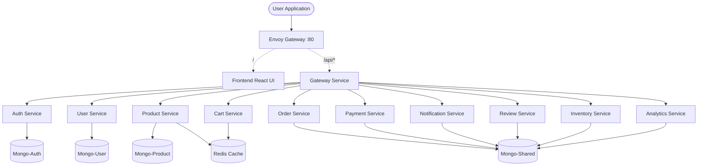

# MERN Microservices Application 🚀

Welcome to the **MERN Microservices Architecture** project! This project is a complete, production-like but beginner-friendly 3-tier microservices application built using modern web and DevOps technologies. 

## 🏗 Architecture Overview

This application consists of **12 Microservices** running on a Kubernetes cluster. 

* **Frontend**: React-based UI (CDN style with Nginx).
* **Backend Services**: Node.js + Express + Mongoose + Redis.
* **Databases**: 4 MongoDB StatefulSets (3 dedicated, 1 shared) and 1 Redis master.
* **API Gateway**: A simple Express proxy (Gateway Service).
* **Routing**: Envoy proxy serves as the entry load balancer.

### Architecture Diagram



### Folder Structure
```text
mern-microservices/
├── frontend/             # React Application and Nginx Dockerfile
├── services/             # 12 Node.js backend microservices
│   ├── auth-service/     # JWT logic, Mongo-auth
│   ├── product-service/  # Mongo-product, Redis caching
│   ├── gateway-service/  # Express http-proxy-middleware
│   └── ...
├── k8s/                  # Kubernetes raw YAML manifests (Namespaces, RBAC, DBs, Envoy)
├── helm/                 # Helm charts
│   ├── microservice-chart/ # Reusable chart for all standard backends
│   └── values/           # 12 different values.yaml files for each service
└── docs/
    └── learning-guide.md # Comprehensive guide explaining DevOps concepts
```

---

## 🛠️ Local Development (Without Kubernetes)

You can run individual services locally. Ensure you have Node 18+ and a local MongoDB/Redis running.

1. **Install dependencies:**
   ```bash
   cd services/auth-service
   npm install
   ```
2. **Start the service:**
   ```bash
   npm start
   ```

---

## 🐳 Docker Deployment

Every service comes with its own `Dockerfile`. To build and push an image:

```bash
cd services/auth-service
docker build -t your-docker-hub-name/auth-service:1.0.0 .
docker push your-docker-hub-name/auth-service:1.0.0
```
> *Repeat the above to build all services if you want to deploy to a real cluster. (For local clusters like minikube, `eval $(minikube docker-env)` or `kind load` can stream images directly).*

---

## ☸️ Kubernetes Deployment

Deploying the stack to a local Kubernetes cluster (like Minikube or Docker Desktop K8s).

### Step 1: Create Namespaces & Databases
First, establish the network partitions and data stores.

```bash
# 1. Namespaces & Network Policies
kubectl apply -f k8s/namespaces.yaml
kubectl apply -f k8s/network-policies.yaml
kubectl apply -f k8s/rbac.yaml

# 2. Databases (StatefulSets)
kubectl apply -f k8s/mongo-auth.yaml
kubectl apply -f k8s/mongo-user.yaml
kubectl apply -f k8s/mongo-product.yaml
kubectl apply -f k8s/mongo-shared.yaml
kubectl apply -f k8s/redis.yaml
```

### Step 2: Deploy Microservices using Helm
We utilize Helm to prevent code duplication (DRY principle). The unified `microservice-chart` is used along with customized `values.yaml` files.

```bash
cd helm

# Frontend
helm install frontend ./microservice-chart -f values/frontend-values.yaml

# Gateway & Auth
helm install gateway-service ./microservice-chart -f values/gateway-service-values.yaml
helm install auth-service ./microservice-chart -f values/auth-service-values.yaml

# Other backends
helm install user-service ./microservice-chart -f values/user-service-values.yaml
helm install product-service ./microservice-chart -f values/product-service-values.yaml
helm install cart-service ./microservice-chart -f values/cart-service-values.yaml
helm install order-service ./microservice-chart -f values/order-service-values.yaml
helm install payment-service ./microservice-chart -f values/payment-service-values.yaml
helm install notification-service ./microservice-chart -f values/notification-service-values.yaml
helm install review-service ./microservice-chart -f values/review-service-values.yaml
helm install inventory-service ./microservice-chart -f values/inventory-service-values.yaml
helm install analytics-service ./microservice-chart -f values/analytics-service-values.yaml
```

### Step 3: Deploy Envoy Gateway
Finally, deploy Envoy which will route traffic entering from port `80` to both the frontend UI and the backend gateway proxy.

```bash
kubectl apply -f k8s/envoy-config.yaml
kubectl apply -f k8s/envoy-deployment.yaml
```

Access your application via the LoadBalancer IP provided by the Envoy service:
```bash
kubectl get svc envoy -n mern-frontend
```

---

## 📓 Documentation
For an in-depth breakdown of **why** these architectural choices were made and **how** they work (excellent for technical interviews), please see the [Learning Guide](docs/learning-guide.md).
